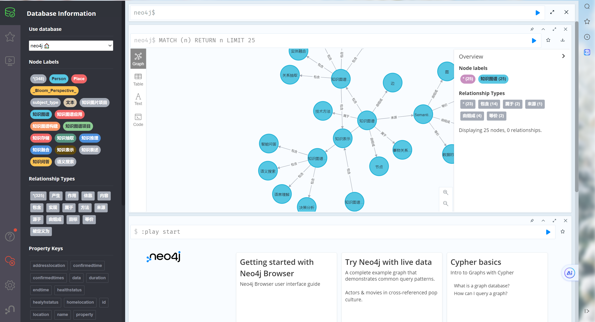

# 从CSV导入neo4j的quick start
## step 1 检查配置

检查电脑是否安装了neo4j，在命令行输入 
```bash
neo4j start
```
观察是否处于启动状态，若出现如下图所示，则表示成功启动，否则配置neo4j，参考 [这里](./neo4j-start.pdf)
配置neo4j


## step 2 运行代码

更改config.json中的超参数，其中 password替换为你自己的neo4j的密码，然后运行csv2neo4j.py
```bash
python csv2neo4j.py
```

## step3 替换数据集

按照mycsv.csv的格式，将你的数据替换上去，确保除data/object这一列以外的列都不存在空白值。

可以直接抄mycsv.csv的格式，也可以更改config.json文件的超参数，以符合你的csv格式

## step 4 查看效果

进入网页[这里](http://localhost:7474/)即可查看你的效果，示例如图:
