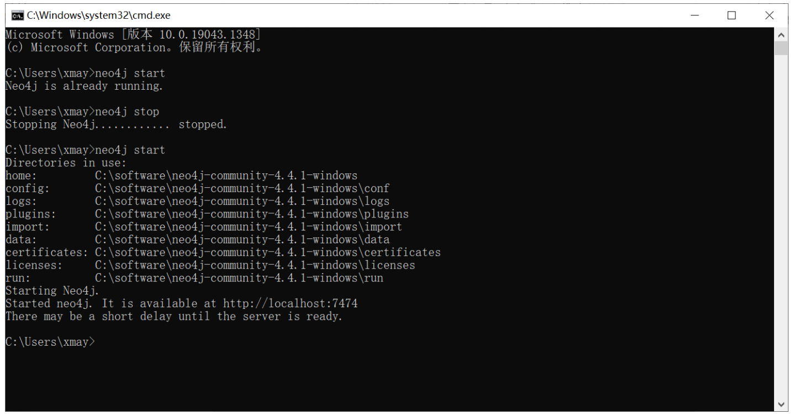

# 知识工程课程知识图谱构建与应用

## 目录结构

```
root
├───requirements.txt
│
├───dataset				//训练数据
├───output				//模型输出
│
├───llm		//DeepKe提供的大语言lora微调代码
│		...
```

## 环境

```
pdfminer3k==1.3.4
numpy==1.26.4
tqdm==4.66.2
pandas==2.2.1
neo4j==5.18.0
py2neo==2021.2.4
ahocorasick==2.1.0
```

## Schema

### 实体 Schema

```
知识图谱
知识表示
知识存储
知识抽取
知识融合
知识推理
语义搜索
知识问答
链接
知识图谱项目
```

### Relation Schema

#### 实体之间的relation

```
包含
等价
来源
属于
由组成
实现
习题
```

#### 属性relation

```
实体_被定义为_文本
实体_内容_文本
实体_英文名_文本
实体_目标_文本
实体_作用_文本
实体_特点_文本
实体_方法_文本
实体_缺点_文本
实体_语法_文本
实体_链接_链接
知识图谱项目_创建时间_时间
知识图谱项目_创建者_人物/实验室
```

## 步骤

### 将PDF转换成TXT

1. 安装`pdfminer`

```
pip install pdfminer.six
pip3 install pdfminer3k
```

2. 在`kg/dataset/utils/pdf2txt.py`中修改需要转换的章节名，并运行

### 将TXT转成JSON

在`kg/dataset/utils/regular_extract.py`中修改需要转换的文件名，并运行

### 微调并测试大语言模型

#### 配置环境

1. 下载基本代码

```
git clone https://github.com/yxyuanxiao/knowledge-graph.git
```

2. 使用`Anaconda`创建一个虚拟环境
```
conda create -n deepke-llm python=3.9
conda activate deepke-llm
```


3. 进入`DeepKE`的大语言目录

```
cd ./knowledge-graph/llm
```


4. 安装大语言所需环境

```
pip install -r requirements.txt
```

#### LoRA微调

我们采用了百川7B大模型在RTX3090的显卡上进行微调

1. 在huggingface上下载[百川大模型](https://huggingface.co/baichuan-inc/Baichuan-13B-Base)，模型文件结构如下

```
Baichuan2-7B-Base
├───config.json
├───configuration_baichuan.py
├───generation_utils.py
├───modeling_baichuan.py
├───pytorch_model-00001-of-00002.bin
├───pytorch_model-00002-of-00002.bin
├───pytorch_model.bin.index.json
├───quantizer.py
├───special_tokens_map.json
├───tokenization_baichuan.py
├───tokenizer_config.json
├───tokenizer.model
```

进入`InstructKGC`目录

```
cd ./knowledge-graph/llm/InstructKGC
mkdir results
mkdir lora
mkdir models
```

将模型放入`models`文件夹中

2. 运行微调脚本

```
bash ft_scripts/fine_baichuan.bash
```

具体参数设置可以参考[DeepKE的GitHub](https://github.com/zjunlp/DeepKE/blob/main/example/llm/InstructKGC/README.md)

#### 预测

在`src/inference.bash`修改需要预测的文件后，执行以下命令

```
bash infer_scripts/infer_baichuan.bash
```

### Neo4j可视化

####  检查配置

检查电脑是否安装了neo4j，在命令行输入 

```bash
neo4j start
```

观察是否处于启动状态，若出现如下图所示，则表示成功启动，否则配置neo4j，参考[这里](./csv2neo4j/neo4j-start.pdf)配置neo4j



安装环境

```
pip install neo4j
```

#### 修改参数并运行代码

更改config.json中的超参数，其中`password`替换为你自己的neo4j的密码，

在`filename_csv`中可以添加多个需要可视化的csv文件

然后运行csv2neo4j.py

```bash
python csv2neo4j.py
```

#### 查看效果

进入网页[这里](http://localhost:7474/)即可查看你的效果，示例如图:


### 知识问答系统

❗️请确保已经运行了neo4j并且根据上一步将数据导入了neo4j

#### 安装环境

```
pip install pyahocorasick
pip install py2neo
```

### 运行代码

运行`kg/QASystem/chatbot.py`
